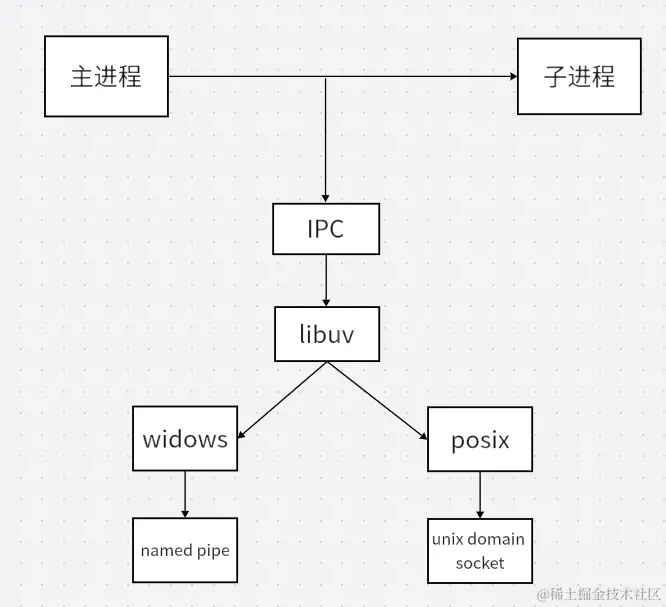
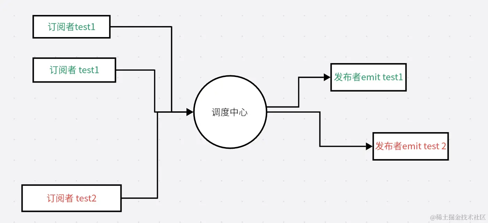

## NodeJs

## 一：概述

### 1：白话 node

1. Nodejs 不属于**JavaScript**应用，也不是编程语言，指的是跨平台的**JavaScript**运行时环境。
2. Nodejs 是构建在 V8 引擎之上，而 V8 引擎是由**C/C++**编写，所以，本质上我们的 JavaScript 需由**C/C++**转化后执行。
3. Nodejs 使用异步 I/O 和事件驱动的设计理念，（所谓 I/O，就是指 input 和 output），可以高效处理大量并发请求，提供了非阻塞式 I/O 接口和事件循环机制，异步 I/O 最终都是由**libuv**事件循环库去实现的。
4. Nodejs 使用**npm**作为包管理工具，相当于 python 的 pip，java 的 Maven。
5. Nodejs 适用于一些 IO 密集应用，不适合 CPU 密集型应用，（所谓 CPU 密集，指图像的处理，或者音频处理需要大量数据结构和算法），nodejsIO 依靠 libuv 有较强的处理能力，而由于 nodejs 是单线程的原因，会造成 CPU 占用率高的问题。若有此方面需求，可使用 C++插件编写，或使用 nodejs 提供的**cluster**。


### 2：应用场景

**前端**：Vue Angular React nuxtjs nextjs

**后端**：serverLess， epxress， Nestjs， koa ， gRPC 服务 ，爬虫 Puppeteer cheerio， BFF 层 网关层，及时性应用 socket.io

**桌面端**：electron，tauri，NWjs

**移动端**：weex，ionic，hybrid，React Native

**基建端**：webpack， vite， rollup， gulp，less，scss ，postCss，babel， swc，inquire， command ，shelljs

**嵌入式**：Ruff js

**单元测试**：jest， vitest， e2e

**CICD**：Jenkins， docker， Husky， miniprogram-ci

**反向代理**：http-proxy， Any-proxy

## 二：NPM

### 1：npm

npm（Node package Manger）是 nodejs 的包管理工具，是基于命令行的工具，用于帮助开发者在自己的项目中安装，升级，移除和管理依赖项。

- 类似于 PHP 的 Composer
- 类似于 Java 的 Maven
- 类似于 Python 的 pip
- 类似于 Rust 的 Cargo

### 2：npm 命令

- **npm init**：初始化一个新的 npm 的项目，创建 package.json 文件
- **npm install**：安装一个包或一组包，并且会在当前目录存放一个 mode_modules
- **npm install package-name** : 安装指定包
- **npm install package-name --save**：安装指定的包，并将添加到 package.json 文件的依赖列表中
- **npm install package-name --save-dev**：安装指定的包，并将其添加到 package.json 文件的开发依赖中
- **npm install -g package-name**：全局安装指定的包
- **npm update package-name**：更新指定的包
- **npm uninstall package-name**：卸载指定的包
- **npm run script-name**：执行 package.json 文件中定义的脚本命名
- **npm search keyword**：搜索 npm 库中包含指定关键字的包
- **npm info pageage-name**：查看指定包的详细信息
- **npm list**：列出当前项目中安装的所有包
- **npm outdated**：列出当前项目中需要更新的包
- **npm audit**：检查当前项目中的依赖是否存在安全漏洞
- **npm publish**：发布自己开发的包到 npm 库中
- **npm login**：登录到 npm 账户
- **npm logout**：注销当前 npm 账户
- **npm link**：将本地模块链接到全局 node_modules 目录下
- **npm config list**：用于列出所有 npm 的配置信息
- **npm get registry**：用于获取当前 npm 配置中的 registry 配置项的值。registry 配置用于指定 npm 包的下载地址，如果未指定，则默认使用 npm 官方的包注册表地址
- **npm set registry** 、**npm config set registry registry-url**命令，将 registry 配置项的值修改为指定的 registry-url 地址

### 3：package json

- **name**：项目名称，必须是唯一的字符串，通常使用小写字母和连字符的组合
- **version**：项目版本号，通常采用语义化版本规范
- **description**：项目描述
- **main**：项目的主入口文件路径，通常是一个 javascript 文件
- **keywords**：项目的关键字列表，方便他人搜索和发现项目
- **author**：项目作者的信息，包括姓名，邮箱，网址等
- **license**：项目的许可证类型，可以是自定义的许可类型或者常见的开源许可证（如 MIT,Apache 等）
- **dependencies**：项目所依赖的包的列表，这些包会在项目运行时自动安装
- **devDependencies**：项目开发过程中所需要的包的列表，这些包不会随项目一起发布，而是只在开发时使用
- **peerDependencies**：项目的同级依赖，即项目所需要的模块被其他模块依赖
- **scripts**：定义了一些脚本命名，比如启动项目，运行测试
- **repository**：项目代码仓库的信息，包含类型，网址
- **bugs**：项目 bug 报告地址
- **homepage**：项目的官方网站或者文档地址

**vession**三段式版本号，如 1.0.0 大版本号 次版本号 修订号，大版本号一般是有重大变化才会升级，次版本号一般是增加功能进行升级，修订号一般是修改 bug 进行升级

**npm Install** 安装模块是扁平化安装，但有时候会出现嵌套情况是因为版本不同。例如 A 依赖 C1.0，B 依赖 C1.0，D 依赖 C2.0，此时 C1.0 就会被放到 A B 的 node_modules 下，C2.0 就会被放到 D 模块下的 node_modules

## 三：Npm install 原理

### 1：npm 安装流程

npm 安装的依赖会放在根目录的 node_modules 中，默认采用的是扁平化的方式安装，并且排序的规则为：**.bin**为第一个，其次为**@系列**，最后是按照**字母顺序 abcd**，并且使用的算法是**广度优先遍历**，具体为在遍历依赖树时，npm 会首先处理根目录下的依赖，然后逐层处理每个依赖包的依赖，直到所有的依赖被处理完毕。在处理每个依赖时，npm 会检查该依赖的版本号是否符合依赖树中其他依赖版本要求，如果不符合，则会尝试安装适合的版本。

### 2：扁平化

所谓扁平化，指的是：

在理想状态下：例如：在安装某个二级模块时，发现第一层级有相同名称，相同版本的模块，便直接复用那个模块。A 模块依赖 C1.0，B 模块也依赖 C1.0，这时，就会把 C1.0 安装到了第一级（与 A，B 同级）。

在非理想状态下，A 模块依赖 C1.0，B 依赖 C2.0，这时就无法复用，会出现模块冗余的情况，就会给 B 继续搞一层 node_modules，就是非扁平化了。

### 3：npm install 原理


**npmrc 文件配置**

```shell
registry=http://registry.npmjs.org/
# 定义npm的registry，即npm的包下载源

proxy=http://proxy.example.com:8080/
# 定义npm的代理服务器，用于访问网络

https-proxy=http://proxy.example.com:8080/
# 定义npm的https代理服务器，用于访问网络

strict-ssl=true
# 是否在SSL证书验证错误时退出

cafile=/path/to/cafile.pem
# 定义自定义CA证书文件的路径

user-agent=npm/{npm-version} node/{node-version} {platform}
# 自定义请求头中的User-Agent

save=true
# 安装包时是否自动保存到package.json的dependencies中

save-dev=true
# 安装包时是否自动保存到package.json的devDependencies中

save-exact=true
# 安装包时是否精确保存版本号

engine-strict=true
# 是否在安装时检查依赖的node和npm版本是否符合要求

scripts-prepend-node-path=true
# 是否在运行脚本时自动将node的路径添加到PATH环境变量中
```

**package-lock.json 的作用**

- **version**：指定当前包的版本号

- **resolved**：指定当前包的下载地址

- **integrity**：用于验证包的完整性

- **dev**：指定当前包是一个开发依赖包

- **bin**：指定当前包中可执行文件的路径和名称

- **engines**：指定当前包所依赖的 Node.js 版本范围

**package-lock.json 缓存原理：**

它通过文件 **name + version +integrity** 信息生成一个唯一的**key**，这个**key**能找到对应的**index-v5**下的缓存记录（也就是**npm cache**文件下的），如果发现有缓存记录，就会找到**tar**包的**hash**值，然后将对应的二进制文件解压到**node_modeules**

## 四：npm run 原理

### 1：执行流程

当我们在执行**npm run dev**时，首先会去读取**package.json**的 script 对应的脚本命令（如：dev:vite），它的查找规则如下：

- 先从当前项目的**node_modules/.bin**中去查找可执行的命令 vite

- 如果没找到就去全局的**node_modules**去找执行的命令 vite

- 如果还没找到，就去环境变量查找

- 再找不到就进行报错

如果找到成功的话，会有三个文件（**xx.sh**，**xx.cmd**，**xx.ps1**），因为 node.js 是跨平台的，所以可执行命令兼容各个平台

- **.sh**文件：给 Linux，Unix，Macos 使用
- **.cmd**文件：给 windows 的 cmd 使用
- **.ps1**文件：给 windows 的 powershell 使用

至此，执行对应文件的命令

### 2：npm 生命周期

```json
"predev": "node prev.js",
"dev": "node index.js",
"postdev": "node post.js"
```

执行**npm run dev**命令时，**predev**会自动执行，它的生命周期是在**dev**之前执行，然后执行**dev**命令，再执行**postdev**

**运用场景**：npm run bulid 在打包完成后，删除 dist 目录

## 五：npx

**npx**是一个命令行工具，它是**npm 5.2.0**版本中新增的功能，它允许用户在不安装全局的包的情况下，运行已安装在本地项目中的包或者远程仓库中的包。

### 1：**npx 优势**

1. 避免全局安装：npx 允许你执行 npm package，而不需要你先全局安装它。
2. 总是使用最新版本：如果你没有在本地安装相应的 npm package，npx 会从 npm 的 package 库中下载并使用最新版。
3. 执行任意 npm 包：npx 不仅可以执行 package.json 的 scripts 部分定义的命令，还可以执行任何 npm package
4. 执行 GitHub gist：npx 甚至可以执行 GitHub gist 或者其他公开的 JavaScript 文件。

### 2：**npx 和 npm 的区别**

**npx**侧重执行命令的，执行某个模块的命令。虽然会自动安装，但是重在执行命令。

**npm**侧重安装或者卸载某个模块。重在安装，并不具备执行某个模块的命令。

### 3：**运行机制**

npx 的运行规则和 npm 是一样的，首先本地目录查看**.bin**，看有没有，如果没有，就去全局的 node_modules 查找，如果还没有，就去下载这个包，然后执行命令，然后删除这个包。

## 六：npm 搭建私服

1. 利用**verdaccio** 可快速搭建私服

   ```shell
   npm install verdaccio -g
   ```

2. 执行执行 **verdaccio**

   ```shell
   verdaccio
   ```

   此时会开启一个默认端口为 4873 的服务，当然，也可以指定端口，如：**verdaccio --listen 9999**，也可指定安装源：**npm install --registry http://localhost:xxxx**

3. 创建用户

   ```shell
   npm adduser --registry http://localhost:xxxx/
   ```

4. 发布 npm

```shell
npm publish --registry http://localhost:xxx/
```

## 七：模块化

### 1：CommonJs 规范

- 引入模块（require）支持以下格式

1. 支持引入内置模块，例如 **http**，**os**，**fs**，**child_process**等内置模块
2. 支持引入第三方模块**express**，**md5**，**koa**等
3. 支持引入自己编写的模块./../等
4. 支持引入**addon** **C++扩展模块.node**文件

```js
const fs = require("node:fs"); // 导入核心模块
const express = require("express"); // 导入 node_modules 目录下的模块
const myModule = require("./myModule.js"); // 导入相对路径下的模块
const nodeModule = require("./myModule.node"); // 导入扩展模块
```

- 导出模块**exports**和**module.exports**

```js
module.exports = {
  hello: function () {
    console.log("hello world");
  },
};
module.exports = 123;
```

### 2：ESM 模块规范

引入模块**import**必须写在头部

使用 esm 模块时必须在**package.json**中开启一个选项，设置**type：module**

```js
import fs from "node:fs";
```

如果需要引入**json**文件，需要使用**断言**并指定类型为 json

```js
import data from "./data.json" assert { type: "json" };
```

加载模块的**整体对象**

```js
import * as all from "xxx.js";
```

**动态导入模块**

import 静态加载不支持掺杂在逻辑中，如果想动态加载，可以使用 import 函数模式

```js
if (true) {
  import("./test.js").then();
}
```

**模块导出**

导出一个默认对象**default**，只能有一个不可重复**export default**

```js
export default {
  name: "test",
};
```

**导出变量**

```js
export const a = 1;
```

### 3：Cjs 和 ESM 的区别

1. Cjs 是基于运行时的同步加载，esm 是基于编译时的异步加载

2. Cjs 是可以修改值的，esm 值不可修改（可读的）,指导出的值

3. Cjs 不可以 tree shaking，esm 支持 tree shaking

4. Cjs 中顶层的 this 指向这个模块本身，而 esm 中顶层 this 指向 undefinded

## 八：全局变量

### 1：globalThis

在**nodejs**中使用**global**定义**全局变量**。定义的变量，可以在引入的文件中也可以访问到该变量，在**浏览器**中我们定义的全局的变量都在**window**，nodejs 在 global，不同的环境还需要判断，于是，在 ECMAScript 2020 出现了一个**globalThis**的全局变量，在 nodejs 环境会自动切换成 global，浏览器环境会自动切换成 window

### 2：全局 API

由于 nodejs 中没有 DOM 和 BOM，除了这些 API，其他 ECMAScript 基本都能用。

```js
__dirname;
```

表示当前模块的所在**目录**的绝对路径

```js
__filename;
```

表示当前模块**文件**的绝对路径，包括文件名和文件扩展名

```js
process;
```

1. **process.argv**：这是一个包含命令行参数的数组。第一个元素是 nodejs 的执行路径，第二个元素是当前执行 javascript 文件的路径，之后的元素是传递给脚本的命令行参数。
2. **process.env**：这是一个包含当前环境变量的对象，可以访问并操作环境变量。
3. **process.cwd()**：这个方法返回当前工作目录的路径。
4. **process.on(event，listenter)**：用于注册事件监听器，可以监听诸如 exit，uncaughtException 等事件，并在事件发生时执行相应的回调函数。
5. **process.exit([code])**：用于退出当前 nodejs 进程，code 可以提供一个可选的退出码作为参数。
6. **process.pid**：返回当前进程的 PID（进程 pid）

注意的是，**process**对象是一个全局对象，可以在任何模块中直接访问，无需导入或定义。

```js
Buffer;
```

1. 创建 Buffer 实例
   - **Buffer.alloc(size，[，fill[，encoding]])**：创建一个指定大小的新的 Buffer 实例，初始内容为零。**fill**参数可用于填充缓冲区，**encoding**参数指定填充的字符编码。
   - **Buffer.from(array)**：创建一个包含给定数组的 Buffer 实例。
   - **Buffer.from(string[，encoding])**：创建一个包含给定字符串的 Buffer 实例。
2. 读取和写入数据
   - **buffer[index]**：通过索引读取或写入 Buffer 实例中的特定字节。
   - **buffer.length**：获取 Buffer 实例的字节长度。
   - **buffer.toString([encoding[，start[，end]]])**：将 Buffer 实例转换成字符串。
3. 转换数据
   - **buffer.toJSON()**：将 Buffer 实例转换为 JSON 对象。
   - **buffer.slice([start[，end]])**：返回一个新的 Buffer 实例，其中包含原始 Buffer 实例的部分内容。
4. 其他方法
   - **Buffer.isBuffer(obj)**：检查一个对象是否是 Buffer 实例。
   - **Buffer.concat(list[，totalLength])**：将一组 Buffer 实例或字节数组连接起来形成一个新的 Buffer 实例。

**Buffer**类在处理文件，网络通信，加密和解密等操作中非常有用，尤其是在需要处理二进制数据时。

## 九：SSR,CSR,SEO

### 1：SSR 与 CSR

**SSR(Server-Side Rendering)**：服务端渲染请求数据和拼接都在服务端完成。

**CSR(Client-Side Rendering)**：客户端完成渲染拼接。

### 2：SSR 与 SSR 区别

1. 页面加载方式
   - **CSR**：在 CSR 中，服务器返回一个初始的 HTML 页面，然后浏览器下载并执行 javascript 文件，javascript 复制动态生成并更新页面内容，这意味着**初始页面加载时，内容较少，页面结构和样式可能存在一定延迟**。
   - **SSR**：在 SSR 中，服务器在返回给浏览器之前，会预先在服务端生产完成的 HTML 页面，包含初始页面的内容。浏览器收到的是已经渲染好的 HTML 页面，因此**初始速度较快。**
2. 内容生成和渲染
   - **CSR**：在 CSR 中，页面的内容生成和渲染是由客户端的 Javascript 脚本负责。当数据变化时，javascript 会重新生成并更新 Dom，从而实现内容的动态变化。这种方式使得前端开发更加灵活，可以**创建复杂的交互和动画效果**。
   - **SSR**：在 SSR 中，服务器在渲染页面时会执行应用程序的代码，并生成最终的 HTML 页面。这意味着页面的初始内容是由服务器生成的，**对于一些静态或少变的内容，可以提供更好的首次加载性能**。
3. 用户交互和体验
   - **CSR**：在 CSR 中，一旦初始页面加载完成，后续的用户交互通常是通过 AJAX 或 WebSocket 与服务器进行数据的交互，然后通过 Javascript 更新内容。这种方式可以提供更快的页面切换和响应速度，但对于**搜索引擎爬虫和 SEO（搜索引擎优化）来说，可能需要一些额外的处理**。
   - **SSR**：在 SSR 中，由于页面是服务器生成的，因此用户交互可以直接在服务器上执行，然后服务器返回更新后的页面，这样可以提供更好的首次加载性能和**对搜索引擎友好的内容。**

### 3：SEO

**SEO(Search Engine Optimization，搜索引擎优化)**

**CSR 应用对 SEO 并不是很友好**，因为在首次加载时获取的 HTML 信息较少，搜索引擎爬虫可能无法获取完整的页面内容

**SSR**在服务器端预先生成完成的 HTML 页面，**搜索引擎爬虫可以直接获取到完整的页面内容**，这有助于搜索引擎正确理解和评估页面内容。

应用场景：

**CSR**应用例如**ToB**后台管理系统 大屏可视化 都可以采用 CSR 渲染不需要很高 SEO 支持

**SSR**应用例如内容密集型应用**ToC** 新闻网站，博客网站，电子商务，门户网站

## 十：Path

### 1：windows posix 差异

**path**模块在不同操作系统是有差异的（windows | posix）

**posix**(Portable Operating System Interface of UNIX)，posix 表示可移植操作系统接口，也就是定义的标准，遵守这套标准的操作系统有（unix，likeunix，linux，macOs，Windows，wsl），定义这套标准的原因是因为希望在不同系统启动进程时调用函数的统一性。但是 windows 并没有完全遵循 posix 标准，在 windows 系统中，路径使用反斜杠（\）作为路径分隔符，这与 posix 系统使用的正斜杠（/）是不相同的，这是历史原因导致，早期 windows 采取不同设计选择。

### 2：path.basename 和 path.dirname

```js
path.basename("c:/a/b/c.js"); // c.js
```

```js
path.dirname("c:/a/b/c.js"); // c:/a/b
```

### 3：path.extname

```js
path.extname("c:/a/b/c.js")  // .js
path.extname("c:/a/b/c.s.d.js.html"） // .html
```

用来返回扩展名，如果有多个.返回最后一个，如果没有扩展名，返回空

### 4：path.join

```js
path.join("/foo", "/ikun"); //  \foo\ikun
path.join("/foo", "/hhh", "/ikun", "../"); // \foo\hhh\
```

用来拼接路径，支持.. ./ ../操作符

### 5：path.resolve

用于将相对路径解析并且返回绝对路径

传入多个绝对路径，它返回最右边的绝对路径

```js
path.resolve("/foo", "/hhh", "/ikun"); // C:\ikun
```

传入绝对路径+相对路径

```js
path.resolve(__dirname, "index.js"); // C:\vscodeFile\node\index.js
```

传入相对路径

```js
path.resolve("index.js"); // C:\vscodeFile\node\index.js  返回工作目录+index.js
```

### 6：path.parse 和 path.format

```js
path.parse("/a/b/c/file.txt");
/*
{
  root: '/',
  dir: '/a/b/c',
  base: 'file.txt',
  ext: '.txt',
  name: 'file'
}
*/
```

用于解析文件路径，返回一个包含路径各个组成部分的对象

- **root**：路径的根目录，即/
- **dir**：文件所在的目录，即/a/b/c
- **base**：文件名，即 file.txt
- **ext**：文件扩展名，即.txt
- **name**：文件名去除扩展名，即 file

```js
path.format({
  root: "/",
  dir: "/a/b/c",
  base: "file.txt",
  ext: ".txt",
  name: "file",
});
// /a/b/c\file.txt
```

**format**正好相反，把对象转回字符串

## 十一：os

### 1：os 模块可以跟操作系统进行交互

- **os.type()**：windows 上返回**Windows_NT**，linux 上返回**Linux**，macOS 上返回**Darwin**
- **os.platform()**：返回标识为其编译 Node.js 二进制文件的操作系统平台字符串。可能的值为**aix**,**darwin**,**freebsd**,**linux**,**openbsd**,**sunos**,**win32**
- **os.release()**：返回操作系统版本，如**10.0.22621**
- **os.homedir()**：返回用户目录，如：C:\Users\zhiqi，原理就是 windows **echo %USERPROFILE%** ; posix **$HOME**
- **os.arch()**：返回 cpu 架构，可能的值为 **arm**,**arm64**,**ia32**,**mips**,**mipsel**,**ppc**,**ppc64**,**s390**,**s390x**,**x64**

### 2：获取 CPU 的线程以及详细信息

```js
os.cpus()[
  ({
    model: "11th Gen Intel(R) Core(TM) i7-11390H @ 3.40GHz",
    speed: 2918,
    times: {
      user: 16952812,
      nice: 0,
      sys: 18975515,
      idle: 197738250,
      irq: 2103046,
    },
  },
  {
    model: "11th Gen Intel(R) Core(TM) i7-11390H @ 3.40GHz",
    speed: 2918,
    times: {
      user: 15995125,
      nice: 0,
      sys: 16142578,
      idle: 201528093,
      irq: 680359,
    },
  },
  {
    model: "11th Gen Intel(R) Core(TM) i7-11390H @ 3.40GHz",
    speed: 2918,
    times: {
      user: 17936703,
      nice: 0,
      sys: 17023218,
      idle: 198705859,
      irq: 421906,
    },
  },
  {
    model: "11th Gen Intel(R) Core(TM) i7-11390H @ 3.40GHz",
    speed: 2918,
    times: {
      user: 13693703,
      nice: 0,
      sys: 15173859,
      idle: 204798234,
      irq: 296984,
    },
  },
  {
    model: "11th Gen Intel(R) Core(TM) i7-11390H @ 3.40GHz",
    speed: 2918,
    times: {
      user: 13841718,
      nice: 0,
      sys: 10708781,
      idle: 209115312,
      irq: 251484,
    },
  },
  {
    model: "11th Gen Intel(R) Core(TM) i7-11390H @ 3.40GHz",
    speed: 2918,
    times: {
      user: 16036875,
      nice: 0,
      sys: 11190078,
      idle: 206438781,
      irq: 239906,
    },
  },
  {
    model: "11th Gen Intel(R) Core(TM) i7-11390H @ 3.40GHz",
    speed: 2918,
    times: {
      user: 19897968,
      nice: 0,
      sys: 13257937,
      idle: 200509859,
      irq: 332703,
    },
  },
  {
    model: "11th Gen Intel(R) Core(TM) i7-11390H @ 3.40GHz",
    speed: 2918,
    times: {
      user: 16954578,
      nice: 0,
      sys: 11156437,
      idle: 205554781,
      irq: 193390,
    },
  })
];
```

- **model**：表示 cpu 的型号信息，表示具体的描述
- **speed**：表示 cpu 的时钟速度，以 MHz 或者 GHz 为单位。
- **times**：是一个包含 CPU 使用时间的对象，包含以下属性：
  - **user**：表示 CPU 被用户程序使用的时间（以毫秒为单位）
  - **nice**：表示 CPU 被优先级较低的用户程序使用的时间（以毫秒为单位）
  - **sys**：表示 CPU 被系统内核使用的时间（以毫秒为单位）
  - **idle**：表示 CPU 处于空闲状态的时间（以毫秒为单位）
  - **irq**：表示 CPU 被硬件中段处理程序使用的时间（以毫秒为单位）

### 3：获取网络信息

```js
os.networkInterfaces()
{
  WLAN: [
    {
      address: 'fe80::af55:ccf8:b6fa:140f',
      netmask: 'ffff:ffff:ffff:ffff::',
      family: 'IPv6',
      mac: '7c:21:4a:9a:72:3e',
      internal: false,
      cidr: 'fe80::af55:ccf8:b6fa:140f/64',
      scopeid: 12
    },
    {
      address: '192.168.2.119',
      netmask: '255.255.255.0',
      family: 'IPv4',
      mac: '7c:21:4a:9a:72:3e',
      internal: false,
      cidr: '192.168.2.119/24'
    }
  ],
  'Loopback Pseudo-Interface 1': [
    {
      address: '::1',
      netmask: 'ffff:ffff:ffff:ffff:ffff:ffff:ffff:ffff',
      family: 'IPv6',
      mac: '00:00:00:00:00:00',
      internal: true,
      cidr: '::1/128',
      scopeid: 0
    },
    {
      address: '127.0.0.1',
      netmask: '255.0.0.0',
      family: 'IPv4',
      mac: '00:00:00:00:00:00',
      internal: true,
      cidr: '127.0.0.1/8'
    }
  ]
}
```

- **address**：表示本地回环接口的 IP 地址，这里为'127.0.0.1'
- **netmask**：表示本地回环接口的子网掩码，这里是'255.0.0.0'
- **family**：表示地址族（address family），这里是'IPv4',表示 IPv4 地址。
- **mac**：表示本地回环接口 MAC 地址，这里是'00:00:00:00:00:00',注意，本地回环接口通常不涉及硬件，因此 MAC 地址通常全为零。
- **inrernal**：表示本地回环接口是否是内部接口，这里是 true，表示它是一个内部接口。
- **cidr**：表示本地回环接口的 CIDR 表示法，即网络地址和子网掩码的组合，这里是'127.0.0.1/8'，表示整个 127.0.0.0 网络。

## 十二：process

process 是 nodejs 操作当前进程和控制当前进程的 API，并且是挂载到 globalThis 下面的全局 API

### 1：process.arch

返回操作系统的 CPU 架构，与 os.arch 一样

'arm'，'arm64'，'ia32'，'mips'，'mipsel'，'ppc'，'ppc64'，'s390'，'x64'

### 2：process.cwd()

返回当前的工作目录，如：C:\vscodeFile\node

### 3：process.argv

```js
process.argv;
// node index.js --open --hh
/*
[
  'C:\\Program Files\\nodejs\\node.exe',
  'C:\\vscodeFile\\node\\index.js',
  '--open',
  '--hh'
]
*/
```

获取执行进程后面的参数，返回是一个数组，各种 cli 脚手架也是使用这种方式接受配置参数，如：webpack

### 4：process.memoryUsage()

用于获取当前进程内存使用情况。该方法返回一个对象，其中包含了各种内存使用指标

```js
process.memoryUsage();
/*
{
  rss: 30797824,
  heapTotal: 6426624,
  heapUsed: 5440472,
  external: 422352,
  arrayBuffers: 17382
}
*/
```

- res：常驻集大小，是进程当前占用的物理内存量，不包括共享内存和页面缓存，反映进程实际占用的物理内存大小
- heapTotal：堆区总大小，是 v8 引擎为 javascript 对象分配的内存量，包括已用和未用的堆内存
- heapUsed：已用堆大小
- external：外部内存使用量，这部分不是由 nodejs 进程分配，而是由其他 C/C++对象或系统分配
- arrayBuffers：用于处理二进制数据的对象类型，它使用了 Javascript 中的 ArrayBuffer 接口，这个属性显示了当前进程中 ArrayBuffers 的数量

### 5：process.exit()

强制进程尽快退出，即使仍有未完全完成的异步操作挂起

### 6：process.kill()

与 exit 类似，kill 可以杀死一个进程，接受一个参数进程 id，可以通过 process.pid 获取

```js
process.kill(process.pid);
```

### 7：process.env

用于读取操作系统所有的环境变量，也可以修改和查询环境变量，注意的是，修改并不会真正影响操作系统的变量，而是只在当前线程生效，线程结束便释放。

**应用场景**：区分**开发环境**和**生产环境**

## 十三：child_process 子进程

### 1：exec

执行命令（异步执行）

```js
const { exec } = require("child_process");
// 执行查看版本命令
exec("node -v", (err, stdout, stderr) => {
  console.log(stdout.toString());
});
// v18.18.2
```

支持的 options 选项

```txt
cwd <string> 子进程的当前工作目录。
env <Object> 环境变量键值对。
encoding <string> 默认为 'utf8'。
shell <string> 用于执行命令的 shell。 在 UNIX 上默认为 '/bin/sh'，在 Windows 上默认为 process.env.ComSpec。 详见 Shell Requirements 与 Default Windows Shell。
timeout <number> 默认为 0。
maxBuffer <number> stdout 或 stderr 允许的最大字节数。 默认为 200*1024。 如果超过限制，则子进程会被终止。 查看警告： maxBuffer and Unicode。
killSignal <string> | <integer> 默认为 'SIGTERM'。
uid <number> 设置该进程的用户标识。（详见 setuid(2)）
gid <number> 设置该进程的组标识。（详见 setgid(2)）
```

### 2：execSync

执行命令（同步执行）

```js
const { exec, execSync } = require("child_process");
const res = execSync("node -v");
console.log(res.toString()); // // v18.18.2
// 打开百度并进入无痕模式
execSync("start chrome http://www.baidu.com --incognito");
```

### 3：execFile

execFile 适合执行可执行文件。例如执行一个 node 脚本，或者 shell 文件，windows 可以编写 cmd 脚本，posix 可以编写脚本

**bat.cmd**

```cmd
echo '开始'
mkdir test
cd ./test
echo cconsole.log('test123456') > test.js
echo '结束'
node test.js
```

**index.js**

```js
const { execFile } = require("child_process");
const path = require("path");
execFile(path.resolve(process.cwd(), "./bat.cmd"), null, (err, stdout) => {
  console.log(stdout.toString());
});
```

### 4：spawn

**spawn**用于执行一些实时获取的信息，因为 spawn 返回的是流，边执行边返回。**exec**是返回一个完整的 buffer，buffer 的大小是 200k，如果超出会报错，而**spawn**是无上限的。

**spawn**在执行完成后会抛出 close 事件监听，并返回状态码，通过状态码可以知道子进程是否顺利执行。**exec**只能通过返回的 buffer 去识别完成状态，识别起来比较麻烦。

```js
const { exec, execSync, execFile, spawn } = require("child_process");
const command = spawn("netstat");
command.stdout.on("data", (stream) => {
  console.log(stream.toString());
});
command.on("close", () => {
  console.log("结束了");
});
```

**exec 底层是通过 execFile 实现，execFile 底层是通过 spawn 实现**

### 5：fork

使用场景为大量计算，或者容易阻塞主线程操作的一些代码，就适合开发 fork

index.js

```js
const { fork } = require("child_process");
const testProcess = fork("./test.js");
testProcess.send("我是主进程");
testProcess.on("message", (data) => {
  console.log("我是主进程接受消息111:", data);
});
```

test.js

```js
process.on("message", (data) => {
  console.log("子进程接受消息", data);
});
process.send("我是子进程");
```

输出：

```js
我是主进程接受消息111: 我是子进程
子进程接受消息 我是主进程
```

send 发送消息，message 接受消息，可以相互发送接收

fork 底层使用的是 IPC 通道进行通讯的



## 十四：events

### 1：EventEmitter

Node.js 核心 API 都是采用**异步事件驱动架构**，简单来说就是通过有效的方法来监听事件状态的变化，并在变化的时候做出相应的动作。

```js
const EventEmitter = require("events");
const bus = new EventEmitter();
bus.on("test", (data) => {
  console.log(data);
});
bus.emit("test", "xxxxxx");
```

### 2：事件模型

Node.js 事件模型采用了**发布订阅者设计模式**



当一个发布者有新消息时，就将这个消息发布到调度中心。调度中心就会将这个消息通知给所有订阅者。这就实现了发布者和订阅者之间的解耦，发布者和订阅者不再直接依赖彼此，他们可以独立地扩展自己。

监听消息数量的默认是**10**个，可以调用**setMaxListeners**传入数量来解除限制

```js
event.setMaxListeners(20);
```

只想监听一次使用**once**，即使 emit 派发多次也只触发一次

```js
const EventEmitter = require("events");
const bus = new EventEmitter();
bus.once("test", (data) => {
  console.log(data);
});
bus.emit("test", "xxxxxx");
bus.emit("test", "xxxxxx");
bus.emit("test", "xxxxxx");
```

取消侦听使用**off**

```js
const EventEmitter = require("events");
const bus = new EventEmitter();
const fn = (data) => {
  console.log(data);
};
bus.on("test", fn);
bus.off("test", fn);
bus.emit("test", "xxxxxx");
```

## 十五：util

util 是 node.js 内部提供的很多实用或者工具类型的 API，方便我们快速开发。

### 1：util.promisify

将回调函数类型变成 promise 风格

```js
import { exec } from "node:child_process";
import util from "node:util";
const execPromise = util.promisify(exec);
execPromise("node -v")
  .then((res) => {
    console.log(res);
  })
  .catch((err) => {
    console.log(err);
  });
// { stdout: 'v18.18.2\r\n', stderr: '' }
```

### 2：util.callbackify

```js
import util from "node:util";
const fn = (type) => {
  if (type === 1) {
    return Promise.resolve("test");
  } else {
    return Promise.reject("error");
  }
};
const callback = util.callbackify(fn);
callback(1, (err, val) => {
  console.log(err, val);
});
// null test
```

### 3：util.format

格式化

```js
import util from "node:util";
console.log(util.format("%s---%s", "foo", "bar"));
// foo---bar
```

- **%s**：**string** 将用于转换除**BigInt**，**Object**和**-0**之外的所有值。**BigInt**值将用 n 表示，没有用户定义的 toString 函数的对象使用具有选项**{depth：0，colors：false，compact：3}**的**util.inspect()**进行检查。
- **%d**：**Number** 将用于转换除**BigInt**和**Symbol**之外的所有值。
- **%i**：**parseInt(value,10)** 用于除**BigInt**和**Symbol**之外的所有值。
- **%f**：**parseFloat(value)** 用于除**Symbol**之外的所有值。
- **%j**：**JSON**。如果参数包含循环引用，则替换为字符串 **'[Circular]'**。
- **%o**：**Object**。具有通用 JavaScript 对象格式的对象的字符串表示形式。 类似于具有选项 **{ showHidden: true, showProxy: true }**的 **util.inspect()**。 这将显示完整的对象，包括不可枚举的属性和代理。
- **%O**：**Object**. 具有通用 JavaScript 对象格式的对象的字符串表示形式。 类似于没有选项的 **util.inspect()**。 这将显示完整的对象，但不包括不可枚举的属性和代理。
- **%c**：**CSS**。此说明符被忽略，将跳过任何传入的 CSS.
- **%%**：单个百分号（‘%’）。这不消费参数。

## 十六：fs

### 1：概述

在 node.js 中，**fs**模块是文件系统模块（File System module）的缩写，它提供了与文件系统进行交互的各种功能。通过 fs 模块，可以执行读取文件，写入文件，更改文件权限，创建目录等操作。

### 2：读取文件

**readFile（异步）**，**readFileSync（同步）**

```js
import fs from "node:fs";

fs.readFile("./index.txt", (err, data) => {
  if (err) return;
  console.log(data.toString());
});

const data = fs.readFileSync("./index.txt");
console.log(data.toString());
```

```js
import fs from "node:fs/promises";
fs.readFile("./index.txt")
  .then((res) => {
    console.log(res.toString());
  })
  .catch((err) => {
    console.log(err);
  });
```

fs 支持同步和异步两种模式，同步方式运行代码，会阻塞下面代码运行。

fs 新增了 promise 版本，只需要在引入包后增加**/promise**即可，fs 便可支持 promise 回调。

fs 返回的是一个 buffer 二级制数据，每两个十六进制数字表示一个字节。

**配置选项**

```js
import fs from "node:fs/promises";
fs.readFile("./index.txt", {
  encoding: "utf-8",
  flag: "",
})
  .then((res) => {
    console.log(res.toString());
  })
  .catch((err) => {
    console.log(err);
  });
```

readFile：第一个参数是**读取的路径**，第二个参数是**配置项**。

**encoding**支持各种编码 utf-8 之类的，

**flag**参数

- **'a'**：打开文件进行追加。如果文件不存在，则创建文件。

- '**ax'**：类似于'a'，但如果路径存在则失败。

- **'a+'**：打开文件进行读取和追加。如果文件不存在，则创建文件。

- **'ax+'**：类似于'a+'，但如果路径存在则失败。

- **'as'**：以同步模式打开文件进行读取和追加。如果文件不存在，则创建该文件。

- **'r'**：打开文件进行读取。如果文件不存在，则会发生异常。

- **'r+'**：打开文件进行读写。如果文件不存在，则会发生异常。

- **'rs+'**：以同步模式打开文件进行读写。指示操作系统绕过本地文件系统缓存。

  这主要用于 NFS 挂载上打开文件，因为它允许跳过可能过时的本地缓存。它对 I/O 性能有非常实际的影响，因此除非需要。否则不建议使用此标志。

  这不会将 fs.open()或 fsPromise.open()变成同步阻塞调用。如果需要同步操作，应该使用类似 fs.openSync()的东西。

- **'w'**：打开文件进行写入。创建（如果它不存在）或截断（如果它存在）该文件。

- **'wx‘**：类似于'w'但如果路径存在则失败。

- **'w+'**：打开文件进行读写。创建（如果它不存在）或截断（如果它存在）该文件。

- **'wx+'**：类似于'w+'，但如果路径存在则失败。

**可读流读取（大文件）**

```js
import fs from "node:fs";
const readStream = fs.createReadStream("./index.txt", {
  encoding: "utf-8",
});
readStream.on("data", (chunk) => {
  console.log(chunk);
});
readStream.on("end", () => {
  console.log("读取完成");
});
```

### 3：创建文件夹

```js
import fs from "node:fs";
// 开启递归创建多个文件夹
fs.mkdir("test/a/b/c", { recursive: true }, () => {});
```

### 4：删除文件夹

```js
import fs from "node:fs";
// 递归删除多个文件夹
fs.rm("test", { recursive: true }, () => {});
```

### 5：重命名文件

```js
import fs from "node:fs";
fs.renameSync("index.txt", "index1.txt");
```

### 6：监听文件的变化

```js
import fs from "node:fs";
fs.watch("index1.txt", (event, filename) => {
  console.log(event, filename);
});
```

### 7：执行顺序与 V8

```js
const fs = require("node:fs");

fs.readFile(
  "./index.txt",
  {
    encoding: "utf-8",
    flag: "r",
  },
  (err, dataStr) => {
    if (err) throw err;
    console.log("fs");
  }
);

setImmediate(() => {
  console.log("setImmediate");
});
// setImmediate fs
```

Node.js 读取文件的时候使用的是**libuv**进行调度的，而**setImmediate**是由**V8**进行调度的，文件读取完成后**libuv**才会将**fs**的结果推入**V8**的队列

### 8：写入文件

**writeFileSync**

```js
import fs from "node:fs";
fs.writeFileSync("index.txt", "hhh");
```

第一个参数：写入的文件；

第二个参数：写入的内容；

第三个是 options 可选项 encoding 编码 mode 权限 flag

**追加写入**

```js
import fs from "node:fs";
fs.writeFileSync("index.txt", "xxx", { flag: "a" });
```

```js
fs.appendFileSync("index.txt", "sss");
```

**可写流**

```js
import fs from "node:fs";
const data = ["1", "2", "3", "4"];
let writeStream = fs.createWriteStream("index.txt");
data.forEach((item) => {
  writeStream.write(item + "\n");
});
writeStream.end();
writeStream.on("finish", () => {
  console.log("写入完成");
});
```

### 9：硬链接和软链接

```js
import fs from "node:fs";
fs.linkSync("index.txt", "index1.txt"); // 硬链接
fs.symlinkSync("index.txt", "index2.txt"); // 软链接
```

**硬链接**：

1. **文件共享**：硬链接允许多个文件名指向同一个文件，这样在不同位置使用不同的文件名引用相同内容。这样的共享文件可以节省存储空间，并且在多个位置对文件的修改会反映在所有引用文件上。
2. **文件备份**：通过创建硬来链接，可以在不复制文件的情况下创建文件的备份。如果原始文件发生更改，备份文件也会自动更新。这样可以节省磁盘空间，并确保备份文件与原始文件保持同步。
3. **文件重命名**：通过创建硬链接，可以为文件创建一个新的文件名，而无需复制或移动文件。这对于需要更改文件名但保持相同内容和属性的场景非常有用。

**软链接**：

1. **软链接可以创建指向文件或目录的引用**。这使得你可以在不复制或移动文件的情况下引用它们，并在不同位置使用不同文件名访问相同的内容。
2. **软链接可以用于创建快捷方式或别名**，使得你可以通过一个简短或易记的路径来访问复杂或深层次的目录结构。
3. **软链接可以用于解决文件或目录的位置变化问题**。如果目标文件或目录被移动或重命名，只需更新软链接的目标路径即可，而不需要修改引用该文件或目录的其他代码。

## 十七：crypto

密码学是计算机科学中的一个重要领域，它涉及到加密、解密、哈希函数和数字签名等技术。crypto 模块的目的是为了提供通用的**加密和哈希算法**。nodejs 用 C/C++实现这些算法后，通过 crypto 这个模块暴露为 JavaScript 接口。

### 1：对称加密

对称加密是一种简单而快速的加密方式，它使用**相同的密钥**（称为对称密钥）来进行**加密**和**解密**。这意味着发送者和接收者在加密和解密过程中都使用相同的密钥。对称加密算法的加密速度很快，适合对大量数据进行加密和解密操作。然而，对称密钥的安全性是一个挑战，因为需要确保发送者和接收者都安全地共享密钥，否则有风险被未授权的人获取密钥并解密数据。

```js
const crypto = require("node:crypto");
// 生成一个随机的16字节的初始化向量（IV）
const iv = Buffer.from(crypto.randomBytes(16));
// 生成一个随机的32字节的密钥
const key = crypto.randomBytes(32);
// 创建加密实例，使用ASE-256-CBC算法，提供密钥和初始化向量
const cipher = crypto.createCipheriv("aes-256-cbc", key, iv);
// 对输入数据进行加密，并输出加密结果的十六进制表示
cipher.update("雨雪霏霏", "utf-8", "hex");
const result = cipher.final("hex");

// 解密
const de = crypto.createDecipheriv("aes-256-cbc", key, iv);
de.update(result, "hex");
const decrypted = de.final("utf-8");
```

### 2：非对称加密

非对称加密使用一对密钥，分别是**公钥**和**私钥**。发送者使用接收者的**公钥进行加密**，而接收者使用自己的**私钥进行解密**。公钥可以自由分享给任何人，而私钥必须保密。非对称加密算法提供了更高的安全性，因为即使公钥泄露，只有持有私钥的接收者才能解密数据。然而，非对称加密算法的**加密速度相对较慢**，不适合加密大量数据。因此，在实际应用中，通常使用非对称加密来交换对称密钥，然后使用对称加密算法来加密实际的数据。

```js
const crypto = require("node:crypto");
// 生成RSA密钥对
const { privateKey, publicKey } = crypto.generateKeyPairSync("rsa", {
  modulusLength: 2048,
});
// 要加密的数据
const text = "算什么男人";
// 使用公钥进行加密
const encrypted = crypto.publicEncrypt(publicKey, Buffer.from(text, "utf-8"));
// 使用私钥进行解密
const decrypted = crypto.privateDecrypt(privateKey, encrypted);
console.log(decrypted.toString());
```

### 3：哈希函数

```js
const crypto = require("node:crypto");
// 要计算哈希的数据
let text = "123456";
// 创建哈希对象，并使用MD5算法
const hash = crypto.createHash("md5");
// 更新哈希对象的数据
hash.update(text);
// 计算哈希值，并以十六进制字符串形式输出
const hashValue = hash.digest("hex");
console.log(hashValue);
```

哈希函数具有以下特点：

1. **固定长度输出**：不论输入数据的大小，哈希函数的输出长度是固定的。常见的哈希函数 MD5 和 SHA-256 生成的哈希值长度分别为 128 位和 256 位。
2. **不可逆性**：哈希函数是单向的，意味着哈希值推导出原始输入数据是非常困难的，几乎不可能。即使输入数据发生微小的变化，其哈希值也会完全不同。
3. **唯一性**：哈希函数应该具有较低的碰撞概率，即不同的输入数据生成相同的哈希值的可能性应该非常小。这有助于确保哈希值能够唯一地标识输入数据。

**使用场景**

1. 我们可以避免密码明文传输，使用 MD5 加密或者 sha256
2. 验证文件的完整性，读取文件内容生成 md5，如果前端上传的 md5 和后端的读取文件内部的 md5 匹配说明文件是完整的
