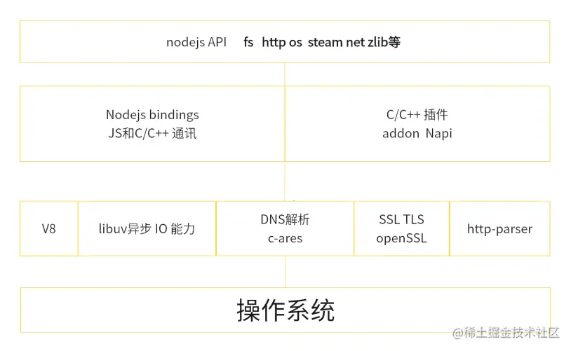

## NodeJs

## 一：概述

### 1：白话 node

1. Nodejs 不属于**JavaScript**应用，也不是编程语言，指的是跨平台的**JavaScript**运行时环境。
2. Nodejs 是构建在 V8 引擎之上，而 V8 引擎是由**C/C++**编写，所以，本质上我们的 JavaScript 需由**C/C++**转化后执行。
3. Nodejs 使用异步 I/O 和事件驱动的设计理念，（所谓 I/O，就是指 input 和 output），可以高效处理大量并发请求，提供了非阻塞式 I/O 接口和事件循环机制，异步 I/O 最终都是由**libuv**事件循环库去实现的。
4. Nodejs 使用**npm**作为包管理工具，相当于 python 的 pip，java 的 Maven。
5. Nodejs 适用于一些 IO 密集应用，不适合 CPU 密集型应用，（所谓 CPU 密集，指图像的处理，或者音频处理需要大量数据结构和算法），nodejsIO 依靠 libuv 有较强的处理能力，而由于 nodejs 是单线程的原因，会造成 CPU 占用率高的问题。若有此方面需求，可使用 C++插件编写，或使用 nodejs 提供的**cluster**。



### 2：应用场景

**前端**：Vue Angular React nuxtjs nextjs

**后端**：serverLess， epxress， Nestjs， koa ， gRPC 服务 ，爬虫 Puppeteer cheerio， BFF 层 网关层，及时性应用 socket.io

**桌面端**：electron，tauri，NWjs

**移动端**：weex，ionic，hybrid，React Native

**基建端**：webpack， vite， rollup， gulp，less，scss ，postCss，babel， swc，inquire， command ，shelljs

**嵌入式**：Ruff js

**单元测试**：jest， vitest， e2e

**CICD**：Jenkins， docker， Husky， miniprogram-ci

**反向代理**：http-proxy， Any-proxy

## 二：NPM

### 1：npm

npm（Node package Manger）是 nodejs 的包管理工具，是基于命令行的工具，用于帮助开发者在自己的项目中安装，升级，移除和管理依赖项。

- 类似于 PHP 的 Composer
- 类似于 Java 的 Maven
- 类似于 Python 的 pip
- 类似于 Rust 的 Cargo

### 2：npm 命令

- **npm init**：初始化一个新的 npm 的项目，创建 package.json 文件
- **npm install**：安装一个包或一组包，并且会在当前目录存放一个 mode_modules
- **npm install package-name** : 安装指定包
- **npm install package-name --save**：安装指定的包，并将添加到 package.json 文件的依赖列表中
- **npm install package-name --save-dev**：安装指定的包，并将其添加到 package.json 文件的开发依赖中
- **npm install -g package-name**：全局安装指定的包
- **npm update package-name**：更新指定的包
- **npm uninstall package-name**：卸载指定的包
- **npm run script-name**：执行 package.json 文件中定义的脚本命名
- **npm search keyword**：搜索 npm 库中包含指定关键字的包
- **npm info pageage-name**：查看指定包的详细信息
- **npm list**：列出当前项目中安装的所有包
- **npm outdated**：列出当前项目中需要更新的包
- **npm audit**：检查当前项目中的依赖是否存在安全漏洞
- **npm publish**：发布自己开发的包到 npm 库中
- **npm login**：登录到 npm 账户
- **npm logout**：注销当前 npm 账户
- **npm link**：将本地模块链接到全局 node_modules 目录下
- **npm config list**：用于列出所有 npm 的配置信息
- **npm get registry**：用于获取当前 npm 配置中的 registry 配置项的值。registry 配置用于指定 npm 包的下载地址，如果未指定，则默认使用 npm 官方的包注册表地址
- **npm set registry** 、**npm config set registry registry-url**命令，将 registry 配置项的值修改为指定的 registry-url 地址

### 3：package json

- **name**：项目名称，必须是唯一的字符串，通常使用小写字母和连字符的组合
- **version**：项目版本号，通常采用语义化版本规范
- **description**：项目描述
- **main**：项目的主入口文件路径，通常是一个 javascript 文件
- **keywords**：项目的关键字列表，方便他人搜索和发现项目
- **author**：项目作者的信息，包括姓名，邮箱，网址等
- **license**：项目的许可证类型，可以是自定义的许可类型或者常见的开源许可证（如 MIT,Apache 等）
- **dependencies**：项目所依赖的包的列表，这些包会在项目运行时自动安装
- **devDependencies**：项目开发过程中所需要的包的列表，这些包不会随项目一起发布，而是只在开发时使用
- **peerDependencies**：项目的同级依赖，即项目所需要的模块被其他模块依赖
- **scripts**：定义了一些脚本命名，比如启动项目，运行测试
- **repository**：项目代码仓库的信息，包含类型，网址
- **bugs**：项目 bug 报告地址
- **homepage**：项目的官方网站或者文档地址

**vession**三段式版本号，如 1.0.0 大版本号 次版本号 修订号，大版本号一般是有重大变化才会升级，次版本号一般是增加功能进行升级，修订号一般是修改 bug 进行升级

**npm Install** 安装模块是扁平化安装，但有时候会出现嵌套情况是因为版本不同。例如 A 依赖 C1.0，B 依赖 C1.0，D 依赖 C2.0，此时 C1.0 就会被放到 A B 的 node_modules 下，C2.0 就会被放到 D 模块下的 node_modules

## 三：Npm install 原理

### 1：npm 安装流程

npm 安装的依赖会放在根目录的 node_modules 中，默认采用的是扁平化的方式安装，并且排序的规则为：**.bin**为第一个，其次为**@系列**，最后是按照**字母顺序 abcd**，并且使用的算法是**广度优先遍历**，具体为在遍历依赖树时，npm 会首先处理根目录下的依赖，然后逐层处理每个依赖包的依赖，直到所有的依赖被处理完毕。在处理每个依赖时，npm 会检查该依赖的版本号是否符合依赖树中其他依赖版本要求，如果不符合，则会尝试安装适合的版本。

### 2：扁平化

所谓扁平化，指的是：

在理想状态下：例如：在安装某个二级模块时，发现第一层级有相同名称，相同版本的模块，便直接复用那个模块。A 模块依赖 C1.0，B 模块也依赖 C1.0，这时，就会把 C1.0 安装到了第一级（与 A，B 同级）。

在非理想状态下，A 模块依赖 C1.0，B 依赖 C2.0，这时就无法复用，会出现模块冗余的情况，就会给 B 继续搞一层 node_modules，就是非扁平化了。

### 3：npm install 原理


**npmrc 文件配置**

```shell
registry=http://registry.npmjs.org/
# 定义npm的registry，即npm的包下载源

proxy=http://proxy.example.com:8080/
# 定义npm的代理服务器，用于访问网络

https-proxy=http://proxy.example.com:8080/
# 定义npm的https代理服务器，用于访问网络

strict-ssl=true
# 是否在SSL证书验证错误时退出

cafile=/path/to/cafile.pem
# 定义自定义CA证书文件的路径

user-agent=npm/{npm-version} node/{node-version} {platform}
# 自定义请求头中的User-Agent

save=true
# 安装包时是否自动保存到package.json的dependencies中

save-dev=true
# 安装包时是否自动保存到package.json的devDependencies中

save-exact=true
# 安装包时是否精确保存版本号

engine-strict=true
# 是否在安装时检查依赖的node和npm版本是否符合要求

scripts-prepend-node-path=true
# 是否在运行脚本时自动将node的路径添加到PATH环境变量中
```

**package-lock.json 的作用**

- **version**：指定当前包的版本号

- **resolved**：指定当前包的下载地址

- **integrity**：用于验证包的完整性

- **dev**：指定当前包是一个开发依赖包

- **bin**：指定当前包中可执行文件的路径和名称

- **engines**：指定当前包所依赖的 Node.js 版本范围

**package-lock.json 缓存原理：**

它通过文件 **name + version +integrity** 信息生成一个唯一的**key**，这个**key**能找到对应的**index-v5**下的缓存记录（也就是**npm cache**文件下的），如果发现有缓存记录，就会找到**tar**包的**hash**值，然后将对应的二进制文件解压到**node_modeules**

## 四：npm run 原理

### 1：执行流程

当我们在执行**npm run dev**时，首先会去读取**package.json**的 script 对应的脚本命令（如：dev:vite），它的查找规则如下：

- 先从当前项目的**node_modules/.bin**中去查找可执行的命令 vite

- 如果没找到就去全局的**node_modules**去找执行的命令 vite

- 如果还没找到，就去环境变量查找

- 再找不到就进行报错

如果找到成功的话，会有三个文件（**xx.sh**，**xx.cmd**，**xx.ps1**），因为 node.js 是跨平台的，所以可执行命令兼容各个平台

- **.sh**文件：给 Linux，Unix，Macos 使用
- **.cmd**文件：给 windows 的 cmd 使用
- **.ps1**文件：给 windows 的 powershell 使用

至此，执行对应文件的命令

### 2：npm 生命周期

```json
"predev": "node prev.js",
"dev": "node index.js",
"postdev": "node post.js"
```

执行**npm run dev**命令时，**predev**会自动执行，它的生命周期是在**dev**之前执行，然后执行**dev**命令，再执行**postdev**

**运用场景**：npm run bulid 在打包完成后，删除 dist 目录

## 五：npx

**npx**是一个命令行工具，它是**npm 5.2.0**版本中新增的功能，它允许用户在不安装全局的包的情况下，运行已安装在本地项目中的包或者远程仓库中的包。

### 1：**npx 优势**

1. 避免全局安装：npx 允许你执行 npm package，而不需要你先全局安装它。
2. 总是使用最新版本：如果你没有在本地安装相应的 npm package，npx 会从 npm 的 package 库中下载并使用最新版。
3. 执行任意 npm 包：npx 不仅可以执行 package.json 的 scripts 部分定义的命令，还可以执行任何 npm package
4. 执行 GitHub gist：npx 甚至可以执行 GitHub gist 或者其他公开的 JavaScript 文件。

### 2：**npx 和 npm 的区别**

**npx**侧重执行命令的，执行某个模块的命令。虽然会自动安装，但是重在执行命令。

**npm**侧重安装或者卸载某个模块。重在安装，并不具备执行某个模块的命令。

### 3：**运行机制**

npx 的运行规则和 npm 是一样的，首先本地目录查看**.bin**，看有没有，如果没有，就去全局的 node_modules 查找，如果还没有，就去下载这个包，然后执行命令，然后删除这个包。

## 六：npm 搭建私服

1. 利用**verdaccio** 可快速搭建私服

   ```shell
   npm install verdaccio -g
   ```

2. 执行执行 **verdaccio**

   ```shell
   verdaccio
   ```

   此时会开启一个默认端口为 4873 的服务，当然，也可以指定端口，如：**verdaccio --listen 9999**，也可指定安装源：**npm install --registry http://localhost:4873**

3. 创建用户

   ```shell
   npm adduser --registry http://localhost:4873/
   ```

4. 发布 npm

```shell
npm publish --registry http://localhost:4873/
```

## 七：模块化

### 1：CommonJs 规范

- 引入模块（require）支持以下格式

1. 支持引入内置模块，例如 **http**，**os**，**fs**，**child_process**等内置模块
2. 支持引入第三方模块**express**，**md5**，**koa**等
3. 支持引入自己编写的模块./../等
4. 支持引入**addon** **C++扩展模块.node**文件

```js
const fs = require("node:fs"); // 导入核心模块
const express = require("express"); // 导入 node_modules 目录下的模块
const myModule = require("./myModule.js"); // 导入相对路径下的模块
const nodeModule = require("./myModule.node"); // 导入扩展模块
```

- 导出模块**exports**和**module.exports**

```js
module.exports = {
  hello: function () {
    console.log("hello world");
  },
};
module.exports = 123;
```

### 2：ESM 模块规范

引入模块**import**必须写在头部

使用 esm 模块时必须在**package.json**中开启一个选项，设置**type：module**

```js
import fs from "node:fs";
```

如果需要引入**json**文件，需要使用**断言**并指定类型为 json

```js
import data from "./data.json" assert { type: "json" };
```

加载模块的**整体对象**

```js
import * as all from "xxx.js";
```

**动态导入模块**

import 静态加载不支持掺杂在逻辑中，如果想动态加载，可以使用 import 函数模式

```js
if (true) {
  import("./test.js").then();
}
```

**模块导出**

导出一个默认对象**default**，只能有一个不可重复**export default**

```js
export default {
  name: "test",
};
```

**导出变量**

```js
export const a = 1;
```

### 3：Cjs 和 ESM 的区别

1. Cjs 是基于运行时的同步加载，esm 是基于编译时的异步加载

2. Cjs 是可以修改值的，esm 值不可修改（可读的）,指导出的值

3. Cjs 不可以 tree shaking，esm 支持 tree shaking

4. Cjs 中顶层的 this 指向这个模块本身，而 esm 中顶层 this 指向 undefinded
